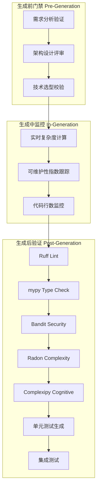
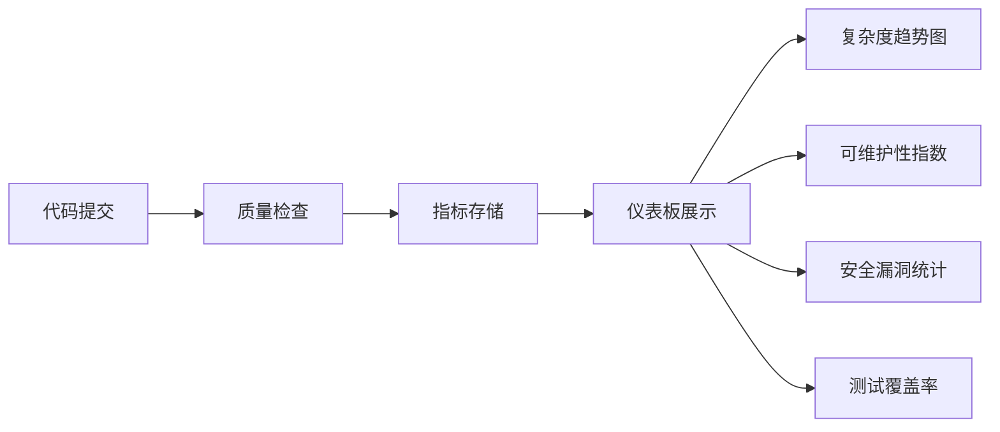

# 质量保障架构

**版本**: v1.0  
**日期**: 2026-06-16  
**关联文档**: system-architecture.md, agent-orchestration.md  

---

## 1. 质量保障概览

### 1.1 三层质量防护



### 1.2 质量指标体系

| 维度 | 指标 | 阈值 | 工具 | 严重性 |
|------|------|------|------|--------|
| 代码风格 | Ruff 规则违规 | 0 | Ruff | High |
| 类型安全 | mypy 错误 | 0 | mypy | High |
| 安全漏洞 | Bandit 高危问题 | 0 | Bandit | Critical |
| 圈复杂度 | Cyclomatic Complexity | < 10 | Radon | Medium |
| 认知复杂度 | Cognitive Complexity | < 15 | Complexipy | Medium |
| 可维护性 | Maintainability Index | > 20 | Radon | Medium |
| 代码重复 | Duplication Ratio | < 5% | Radon | Low |
| 测试覆盖率 | Line Coverage | > 80% | pytest-cov | High |

---

## 2. 质量门禁引擎

### 2.1 架构设计

```python
from dataclasses import dataclass
from typing import List, Dict
from enum import Enum

class Severity(Enum):
    CRITICAL = "critical"
    HIGH = "high"
    MEDIUM = "medium"
    LOW = "low"

@dataclass
class QualityIssue:
    """质量问题"""
    tool: str
    severity: Severity
    file_path: str
    line: int
    message: str
    rule_id: str

@dataclass
class QualityReport:
    """质量报告"""
    passed: bool
    issues: List[QualityIssue]
    metrics: Dict[str, float]
    summary: str
```

### 2.2 质量门禁实现

```python
class QualityGateEngine:
    """质量门禁引擎"""
    
    def __init__(self):
        self.checkers = [
            RuffChecker(),
            MypyChecker(),
            BanditChecker(),
            RadonChecker(),
            ComplexipyChecker()
        ]
    
    def check(self, code_files: Dict[str, str]) -> QualityReport:
        """执行质量检查"""
        all_issues = []
        all_metrics = {}
        
        # 并行执行所有检查器
        with ThreadPoolExecutor(max_workers=5) as executor:
            futures = {
                executor.submit(checker.check, code_files): checker
                for checker in self.checkers
            }
            
            for future in as_completed(futures):
                checker = futures[future]
                result = future.result()
                all_issues.extend(result.issues)
                all_metrics.update(result.metrics)
        
        # 判断是否通过
        passed = self._evaluate_pass(all_issues, all_metrics)
        
        return QualityReport(
            passed=passed,
            issues=all_issues,
            metrics=all_metrics,
            summary=self._generate_summary(all_issues, all_metrics)
        )
    
    def _evaluate_pass(self, issues: List[QualityIssue], metrics: Dict) -> bool:
        """评估是否通过质量门禁"""
        # 任何 CRITICAL 问题直接失败
        if any(issue.severity == Severity.CRITICAL for issue in issues):
            return False
        
        # HIGH 问题数量 > 5 失败
        high_issues = [i for i in issues if i.severity == Severity.HIGH]
        if len(high_issues) > 5:
            return False
        
        # 圈复杂度平均值 >= 10 失败
        if metrics.get("avg_complexity", 0) >= 10:
            return False
        
        # 可维护性指数 < 20 失败
        if metrics.get("maintainability_index", 0) < 20:
            return False
        
        return True
```

---

## 3. 静态分析工具集成

### 3.1 Ruff Checker

```python
import subprocess
import json

class RuffChecker:
    """Ruff 代码规范检查"""
    
    def check(self, code_files: Dict[str, str]) -> CheckResult:
        """执行 Ruff 检查"""
        # 写入临时文件
        temp_dir = self._write_temp_files(code_files)
        
        # 执行 Ruff
        result = subprocess.run(
            ["ruff", "check", temp_dir, "--output-format=json"],
            capture_output=True,
            text=True
        )
        
        # 解析结果
        violations = json.loads(result.stdout)
        issues = [
            QualityIssue(
                tool="ruff",
                severity=Severity.HIGH,
                file_path=v["filename"],
                line=v["location"]["row"],
                message=v["message"],
                rule_id=v["code"]
            )
            for v in violations
        ]
        
        return CheckResult(issues=issues, metrics={"ruff_violations": len(issues)})
```

### 3.2 mypy Checker

```python
class MypyChecker:
    """mypy 类型检查"""
    
    def check(self, code_files: Dict[str, str]) -> CheckResult:
        temp_dir = self._write_temp_files(code_files)
        
        result = subprocess.run(
            ["mypy", temp_dir, "--strict", "--json-report", "/tmp/mypy-report"],
            capture_output=True,
            text=True
        )
        
        # 解析 mypy JSON 报告
        with open("/tmp/mypy-report/index.json") as f:
            report = json.load(f)
        
        issues = []
        for error in report.get("errors", []):
            issues.append(QualityIssue(
                tool="mypy",
                severity=Severity.HIGH,
                file_path=error["file"],
                line=error["line"],
                message=error["message"],
                rule_id=error["code"]
            ))
        
        return CheckResult(issues=issues, metrics={"mypy_errors": len(issues)})
```

### 3.3 Bandit Checker

```python
class BanditChecker:
    """Bandit 安全扫描"""
    
    def check(self, code_files: Dict[str, str]) -> CheckResult:
        temp_dir = self._write_temp_files(code_files)
        
        result = subprocess.run(
            ["bandit", "-r", temp_dir, "-f", "json"],
            capture_output=True,
            text=True
        )
        
        report = json.loads(result.stdout)
        
        issues = []
        for finding in report.get("results", []):
            severity_map = {
                "HIGH": Severity.CRITICAL,
                "MEDIUM": Severity.HIGH,
                "LOW": Severity.MEDIUM
            }
            
            issues.append(QualityIssue(
                tool="bandit",
                severity=severity_map[finding["issue_severity"]],
                file_path=finding["filename"],
                line=finding["line_number"],
                message=finding["issue_text"],
                rule_id=finding["test_id"]
            ))
        
        return CheckResult(
            issues=issues,
            metrics={
                "security_high": len([i for i in issues if i.severity == Severity.CRITICAL]),
                "security_medium": len([i for i in issues if i.severity == Severity.HIGH])
            }
        )
```

### 3.4 Radon Checker

```python
from radon.complexity import cc_visit
from radon.metrics import mi_visit

class RadonChecker:
    """Radon 复杂度分析"""
    
    def check(self, code_files: Dict[str, str]) -> CheckResult:
        issues = []
        complexities = []
        maintainability_indices = []
        
        for file_path, code in code_files.items():
            # 圈复杂度
            cc_results = cc_visit(code)
            for result in cc_results:
                complexities.append(result.complexity)
                
                if result.complexity >= 10:
                    issues.append(QualityIssue(
                        tool="radon",
                        severity=Severity.MEDIUM,
                        file_path=file_path,
                        line=result.lineno,
                        message=f"函数 {result.name} 圈复杂度过高: {result.complexity}",
                        rule_id="C901"
                    ))
            
            # 可维护性指数
            mi_result = mi_visit(code, multi=True)
            maintainability_indices.append(mi_result)
            
            if mi_result < 20:
                issues.append(QualityIssue(
                    tool="radon",
                    severity=Severity.MEDIUM,
                    file_path=file_path,
                    line=1,
                    message=f"可维护性指数过低: {mi_result:.2f}",
                    rule_id="MI"
                ))
        
        return CheckResult(
            issues=issues,
            metrics={
                "avg_complexity": sum(complexities) / len(complexities) if complexities else 0,
                "max_complexity": max(complexities) if complexities else 0,
                "maintainability_index": sum(maintainability_indices) / len(maintainability_indices) if maintainability_indices else 0
            }
        )
```

---

## 4. 增量编辑与 Git 集成

### 4.1 增量编辑引擎

```python
import libcst as cst
from typing import Dict

class IncrementalEditor:
    """增量代码编辑器"""
    
    def modify_function(self, source_code: str, function_name: str, new_body: str) -> str:
        """仅修改指定函数"""
        module = cst.parse_module(source_code)
        
        class FunctionTransformer(cst.CSTTransformer):
            def leave_FunctionDef(self, original_node, updated_node):
                if updated_node.name.value == function_name:
                    # 仅替换函数体
                    new_body_nodes = cst.parse_statement(new_body)
                    return updated_node.with_changes(body=new_body_nodes)
                return updated_node
        
        modified_tree = module.visit(FunctionTransformer())
        return modified_tree.code
```

### 4.2 Git 集成

```python
import git
from pathlib import Path

class GitIntegration:
    """Git 版本控制集成"""
    
    def __init__(self, repo_path: str):
        self.repo = git.Repo(repo_path)
    
    def commit_changes(self, files: Dict[str, str], message: str) -> str:
        """提交代码变更"""
        # 写入文件
        for file_path, content in files.items():
            Path(file_path).write_text(content)
            self.repo.index.add([file_path])
        
        # 创建提交
        commit = self.repo.index.commit(message)
        return commit.hexsha
    
    def get_diff(self, commit_hash: str) -> str:
        """获取提交的 Diff"""
        commit = self.repo.commit(commit_hash)
        return self.repo.git.diff(commit.parents[0], commit)
    
    def rollback(self, commit_hash: str):
        """回滚到指定提交"""
        self.repo.head.reset(commit_hash, index=True, working_tree=True)
```

---

## 5. Wily 历史追踪

### 5.1 初始化

```bash
# 构建历史数据库
wily build src/

# 生成报告
wily report src/
```

### 5.2 集成到 CI

```yaml
# .github/workflows/quality.yml
- name: Track Quality Metrics
  run: |
    wily build src/
    wily diff HEAD~1 --all --metrics maintainability.mi,complexity.avg
```

### 5.3 趋势分析

```python
import subprocess
import json

def get_quality_trend(file_path: str, metric: str) -> list:
    """获取质量指标趋势"""
    result = subprocess.run(
        ["wily", "graph", file_path, "-m", metric, "--format", "json"],
        capture_output=True,
        text=True
    )
    return json.loads(result.stdout)
```

---

## 6. 测试生成

### 6.1 单元测试生成 Agent

```python
class TesterAgent:
    """测试生成 Agent"""
    
    def __init__(self):
        self.llm = ChatAnthropic(model="claude-3-5-haiku-20241022")
    
    def generate_tests(self, code: str, spec: str) -> str:
        """生成单元测试"""
        prompt = f"""
基于以下代码生成 pytest 单元测试：

代码：
{code}

规格：
{spec}

要求：
1. 覆盖所有公共方法
2. 包含边界条件测试
3. 使用 pytest fixtures
4. Mock 外部依赖
5. 目标覆盖率 > 80%
"""
        result = self.llm.invoke(prompt)
        return result.content
```

### 6.2 测试覆盖率检查

```python
def check_coverage(test_dir: str, source_dir: str) -> float:
    """检查测试覆盖率"""
    result = subprocess.run(
        ["pytest", test_dir, f"--cov={source_dir}", "--cov-report=json"],
        capture_output=True
    )
    
    with open("coverage.json") as f:
        report = json.load(f)
    
    return report["totals"]["percent_covered"]
```

---

## 7. 质量仪表板

### 7.1 实时质量指标



### 7.2 前端展示（React）

```typescript
import { Card, Progress, Badge } from '@/components/ui'

interface QualityMetrics {
  avgComplexity: number
  maintainabilityIndex: number
  testCoverage: number
  securityIssues: number
}

export function QualityDashboard({ metrics }: { metrics: QualityMetrics }) {
  return (
    <div className="grid grid-cols-2 gap-4">
      <Card>
        <h3>圈复杂度</h3>
        <Progress value={metrics.avgComplexity} max={10} />
        <span>{metrics.avgComplexity.toFixed(1)} / 10</span>
      </Card>
      
      <Card>
        <h3>可维护性指数</h3>
        <Progress value={metrics.maintainabilityIndex} max={100} />
        <span>{metrics.maintainabilityIndex.toFixed(1)}</span>
      </Card>
      
      <Card>
        <h3>测试覆盖率</h3>
        <Progress value={metrics.testCoverage} max={100} />
        <span>{metrics.testCoverage.toFixed(1)}%</span>
      </Card>
      
      <Card>
        <h3>安全问题</h3>
        <Badge variant={metrics.securityIssues === 0 ? 'success' : 'destructive'}>
          {metrics.securityIssues} 个问题
        </Badge>
      </Card>
    </div>
  )
}
```

---

## 8. 关键决策（ADR）

### ADR-009: 质量门禁失败时自动修复而非拒绝

**决策**：质量检查失败时，Coder Agent 自动修复，而非直接拒绝

**理由**：
1. 用户体验更好（无需手动修复）
2. 最多重试 3 次
3. 失败后提供详细报告

**影响**：
- 增加 LLM 调用次数（成本上升）
- 生成时间稍长
- 质量稳定性更高

### ADR-010: 使用 Radon 而非 Lizard

**决策**：使用 Radon 进行复杂度分析

**理由**：
1. Python 原生实现（无额外依赖）
2. 支持可维护性指数
3. 与 pytest 集成良好

**影响**：
- 仅支持 Python
- 后续扩展需集成其他工具


