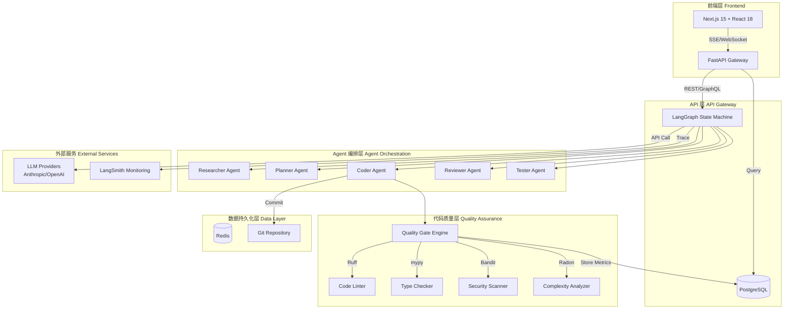
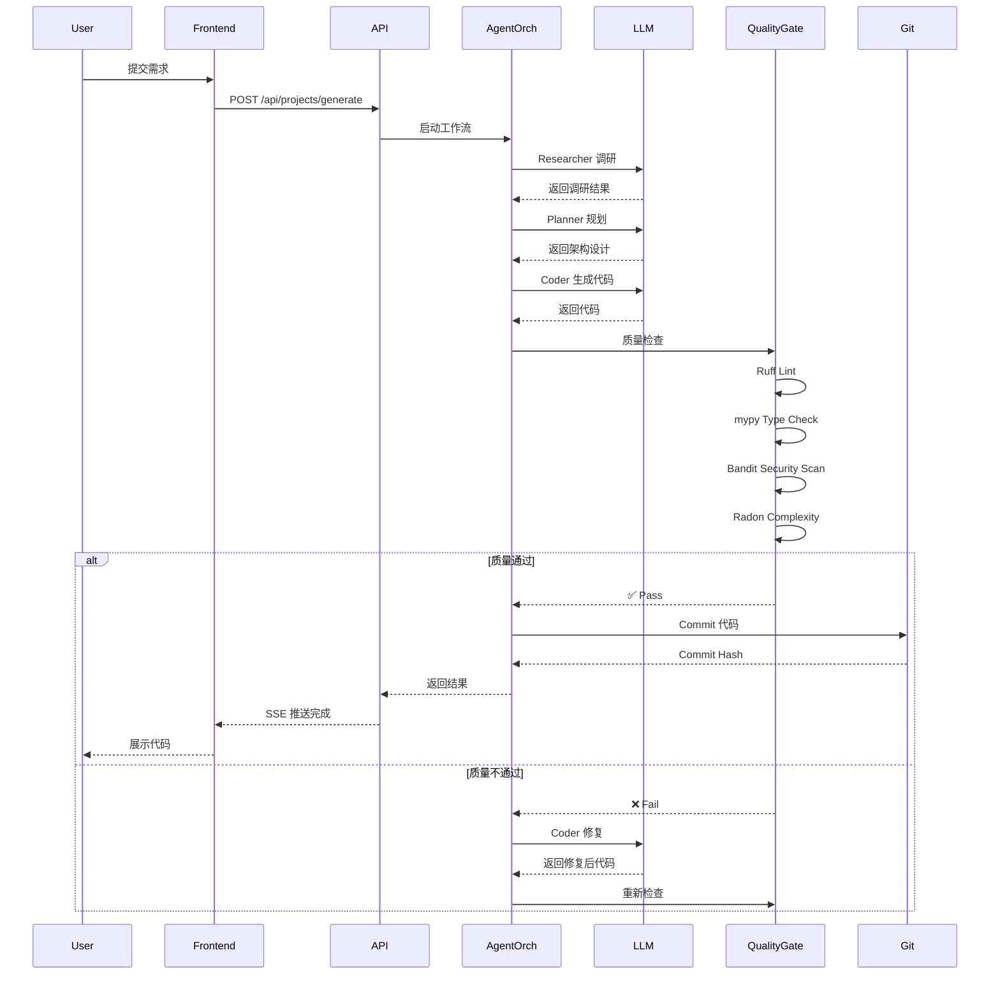
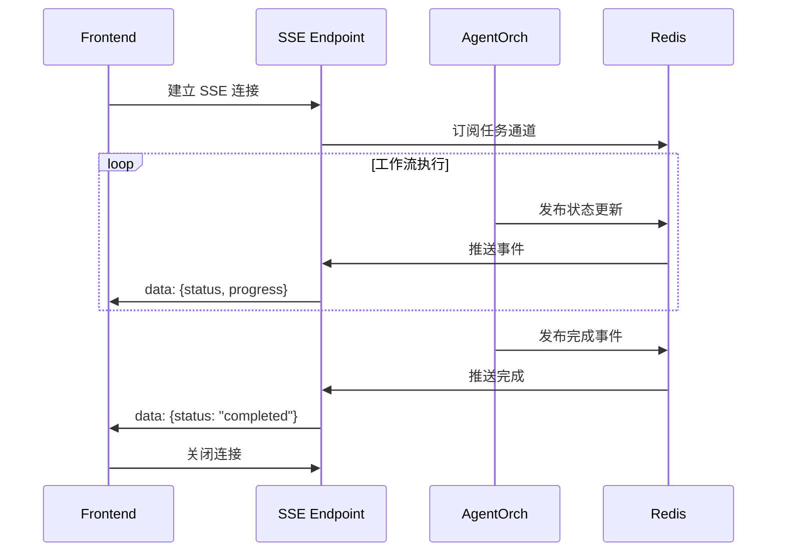
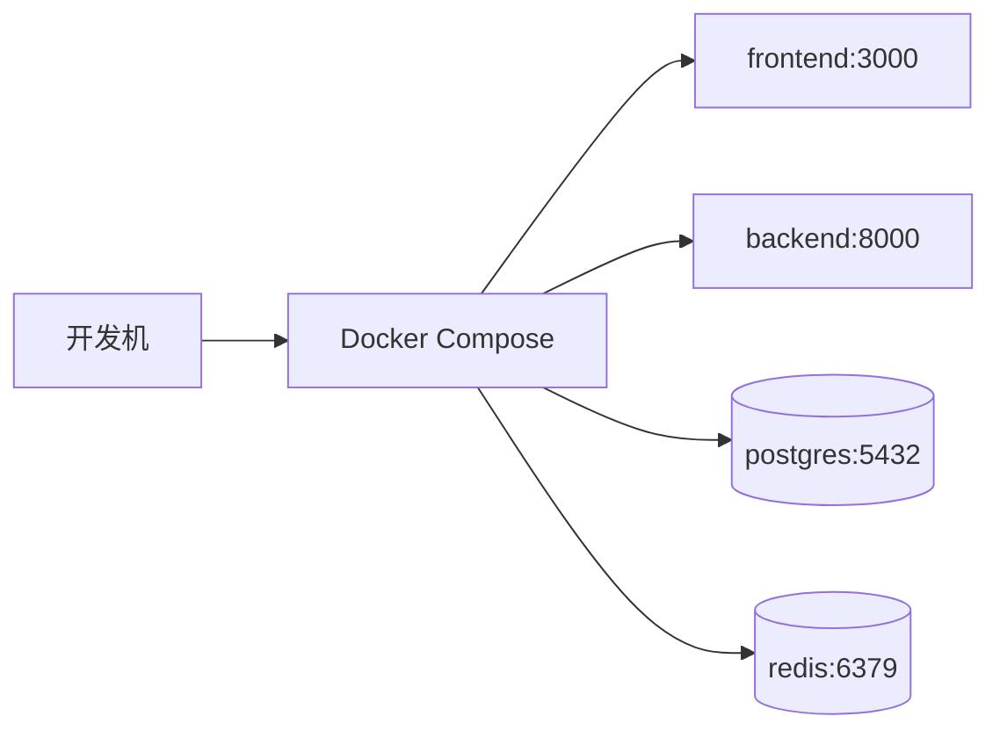
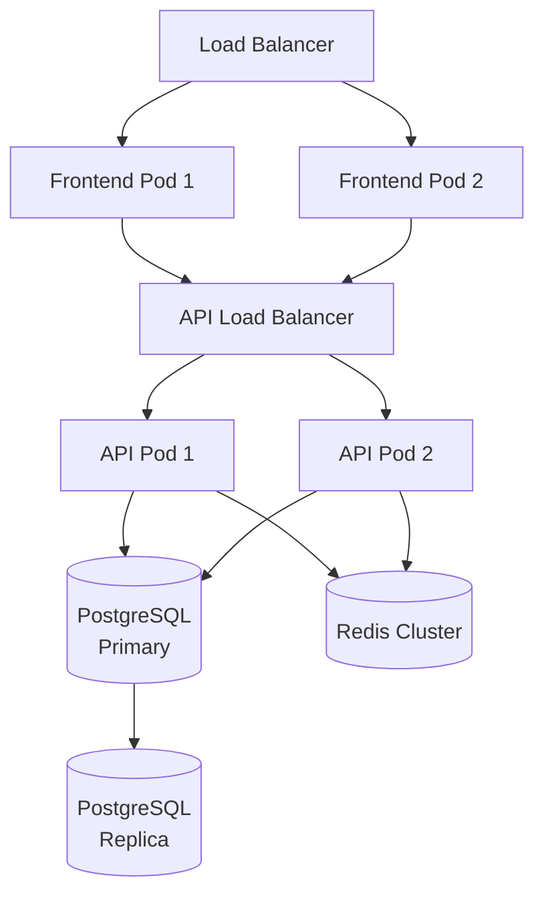

# 系统架构设计

**版本**: v1.0
**日期**: 2026-06-16
**状态**: 设计阶段

---

## 1. 架构概览

### 1.1 系统定位

AI 代码生成平台，专注于**生产级代码质量**，通过 Multi-Agent 协作和内置质量门禁，确保生成代码的可维护性和安全性。

### 1.2 核心特性

- **质量优先**：内置静态分析（Ruff/mypy/Bandit）+ 复杂度门禁（CC<10, MI>20）
- **可迭代性**：增量编辑 + Git 集成 + 变更追踪
- **Multi-Agent 协作**：Researcher → Planner → Coder → Reviewer → Tester
- **实时可视化**：React Flow 工作流展示 + 质量仪表板
- **成本透明**：实时 Token 统计 + 智能模型选择

---

## 2. 分层架构

### 2.1 架构图



### 2.2 层级说明

#### 前端层（Frontend Layer）

- **技术栈**：Next.js 15 + React 18 + shadcn/ui + Tailwind CSS
- **职责**：
  - 用户交互界面
  - 实时状态展示（SSE）
  - 工作流可视化（React Flow）
  - 任务看板管理
- **通信方式**：
  - HTTP REST API（数据查询）
  - Server-Sent Events（流式输出）
  - WebSocket（聊天交互）

#### API 层（API Gateway）

- **技术栈**：FastAPI + Pydantic + SQLAlchemy
- **职责**：
  - 请求路由和鉴权
  - 数据验证和序列化
  - 速率限制
  - 任务队列管理（Celery）
- **端点类型**：
  - RESTful API（CRUD 操作）
  - WebSocket API（实时通信）
  - SSE Endpoint（流式推送）

#### Agent 编排层（Agent Orchestration Layer）

- **技术栈**：LangGraph + LangChain + Python 3.11+
- **职责**：
  - Multi-Agent 工作流编排
  - 状态机管理
  - Agent 间通信协调
  - LLM 调用封装
- **核心组件**：
  - StateGraph（状态机定义）
  - CheckpointMemory（持久化检查点）
  - MessageBus（消息传递）

#### 代码质量层（Quality Assurance Layer）

- **技术栈**：Ruff + mypy + Bandit + Radon + Complexipy
- **职责**：
  - 静态代码分析
  - 类型安全检查
  - 安全漏洞扫描
  - 复杂度计算
  - 质量门禁执行
- **触发时机**：
  - 代码生成后（自动触发）
  - 用户手动触发
  - CI/CD 流水线

#### 数据持久化层（Data Layer）

- **PostgreSQL**：
  - 项目元数据
  - 任务状态
  - 质量指标历史
  - 用户数据
- **Redis**：
  - 会话缓存
  - 任务队列
  - 实时状态
- **Git Repository**：
  - 代码版本控制
  - 变更历史
  - 分支管理

---

## 3. 数据流

### 3.1 代码生成流程



### 3.2 实时通信流程



---

## 4. 关键技术决策（ADR）

### ADR-001: 选择 LangGraph 作为 Agent 编排框架

**决策**：使用 LangGraph 而非 CrewAI

**理由**：

1. 生产就绪度高（3450万月下载）
2. 显式状态机管理（可追溯、可调试）
3. 持久化检查点支持（恢复机制）
4. LangChain 生态集成

**影响**：

- 学习曲线中等
- 需要编写更多样板代码
- 灵活性和可控性更高

### ADR-002: 采用分层架构而非微服务

**决策**：初期采用单体分层架构，预留微服务演进路径

**理由**：

1. 初期团队规模小（3-5人）
2. 降低运维复杂度
3. 快速迭代优先
4. 模块边界清晰，便于后续拆分

**影响**：

- 部署简单（Docker Compose）
- 模块耦合风险需通过接口隔离
- 单点故障风险需监控和备份

### ADR-003: 选择 PostgreSQL 而非 NoSQL

**决策**：使用 PostgreSQL 作为主数据库

**理由**：

1. 项目元数据需要事务支持
2. 质量指标历史需要复杂查询
3. 关系型数据占主导
4. JSONB 支持灵活扩展

**影响**：

- 强一致性保障
- 需要设计规范化数据模型
- 性能优化依赖索引和查询优化

### ADR-004: 质量门禁同步执行而非异步

**决策**：代码生成后同步执行质量检查

**理由**：

1. 用户需要即时反馈
2. 质量检查耗时可控（<5秒）
3. 避免异步带来的状态复杂性

**影响**：

- 响应时间稍长（可接受）
- 简化错误处理
- 流式输出友好

### ADR-005: 使用 SSE 而非纯 WebSocket

**决策**：代码生成流式输出使用 SSE，聊天使用 WebSocket

**理由**：

1. SSE 更简单（单向推送）
2. 自动重连机制
3. 基于 HTTP（无需额外协议）
4. WebSocket 保留用于双向交互场景

**影响**：

- SSE 适用于大部分场景
- WebSocket 仅用于聊天模块
- 降低前端复杂度

---

## 5. 非功能性需求

### 5.1 性能指标

| 指标 | 目标值 | 度量方式 |
|------|--------|---------|
| API 响应时间 | P95 < 500ms | APM 监控 |
| 代码生成时间 | < 30s（简单）<br/>< 2min（复杂） | 任务时长统计 |
| 质量检查时间 | < 5s | 工具执行时间 |
| 并发用户数 | 100+ | 压力测试 |
| 数据库查询 | P95 < 100ms | 慢查询日志 |

### 5.2 可用性

| 指标 | 目标值 |
|------|--------|
| 系统可用性 | 99.5% |
| 故障恢复时间 | < 30min |
| 数据备份频率 | 每日 |
| 备份保留期 | 30天 |

### 5.3 可扩展性

**水平扩展**：

- API 层：无状态设计，支持负载均衡
- Agent 编排层：任务队列 + 多 Worker
- 数据库：读写分离 + 主从复制

**垂直扩展**：

- 初期 4C8G 满足 100+ 并发
- Agent 节点可独立扩容

### 5.4 安全性

| 层级 | 措施 |
|------|------|
| 网络层 | HTTPS + CORS |
| 应用层 | JWT 鉴权 + RBAC |
| 数据层 | 加密存储 + SQL 参数化 |
| 代码层 | Bandit 安全扫描 |

---

## 6. 部署拓扑

### 6.1 本地开发环境



**配置**：

```yaml
# docker-compose.yml
services:
  frontend:
    build: ./frontend
    ports: ["3000:3000"]
  backend:
    build: ./backend
    ports: ["8000:8000"]
    depends_on: [postgres, redis]
  postgres:
    image: postgres:16
    volumes: ["pgdata:/var/lib/postgresql/data"]
  redis:
    image: redis:7
```

### 6.2 生产环境（云部署）



**技术栈**：

- 容器编排：Kubernetes（可选）或 Docker Swarm
- 负载均衡：Nginx / Traefik
- 数据库：托管 PostgreSQL（AWS RDS / GCP Cloud SQL）
- 缓存：托管 Redis（AWS ElastiCache / GCP Memorystore）
- 监控：Prometheus + Grafana
- 日志：ELK Stack / Loki

---

## 7. 技术栈总览

| 层级 | 组件 | 技术 | 版本 |
|------|------|------|------|
| 前端 | 框架 | Next.js | 15+ |
| 前端 | UI 库 | React + shadcn/ui | 18+ |
| 前端 | 样式 | Tailwind CSS | 3.4+ |
| 前端 | 状态管理 | Zustand | 4.5+ |
| 后端 | 框架 | FastAPI | 0.115+ |
| 后端 | ORM | SQLAlchemy | 2.0+ |
| 后端 | 任务队列 | Celery | 5.4+ |
| Agent | 编排 | LangGraph | 0.2+ |
| Agent | LLM 集成 | LangChain | 0.3+ |
| 质量 | Linter | Ruff | latest |
| 质量 | Type Checker | mypy | 1.10+ |
| 质量 | Security | Bandit | 1.7+ |
| 质量 | Complexity | Radon | 6.0+ |
| 数据库 | 主数据库 | PostgreSQL | 16+ |
| 缓存 | 缓存/队列 | Redis | 7+ |
| 版本控制 | VCS | Git | 2.40+ |
| 监控 | APM | LangSmith | latest |

---

## 8. 下一步行动

1. **Agent 编排架构详细设计**（agent-orchestration.md）
2. **质量保障架构详细设计**（quality-assurance.md）
3. **数据模型设计**（data-model.md）
4. **API 设计**（api-design.md）
5. **部署架构详细设计**（deployment.md）
