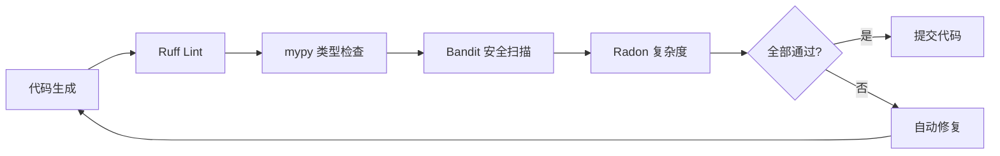

# 技术选型决策文档

**版本**: v1.0
**日期**: 2026-06-16
**状态**: 已批准

---

## 执行摘要

本文档基于 6 份深度调研报告，为 AI 代码生成平台制定技术选型方案。核心差异化策略：**质量优先 + 可迭代性 + Multi-Agent 编排**，通过内置静态分析和复杂度门禁，确保生成代码的生产可用性。

**关键决策**：

- Python Agent 框架：LangGraph
- 代码质量工具链：Ruff + mypy + Bandit + Radon
- Web UI 技术栈：Next.js 15 + React 18 + shadcn/ui
- 初期支持：FastAPI Web 应用

---

## 1. 核心框架

### 1.1 Python Agent 框架：LangGraph

#### 选型理由

**生产就绪度**：

- 月下载量 3,450 万（CrewAI 的 10 倍）
- LangChain 生态核心组件
- 企业级支持（LangSmith 监控）

**技术优势**：

1. **强状态管理**：
   - 基于 StateGraph 的显式状态机
   - 持久化检查点（恢复/回放）
   - 条件边支持复杂决策流

2. **灵活编排**：
   - 自定义节点逻辑
   - 循环和递归支持
   - 动态工作流生成

3. **可观测性**：
   - LangSmith 集成（追踪/调试）
   - 内置日志和性能监控

#### 替代方案对比

| 特性 | LangGraph | CrewAI | AutoGPT |
|------|-----------|--------|---------|
| 月下载量 | 3,450 万 | 319 万 | 停滞 |
| 状态管理 | 显式状态机 | 隐式 | 弱 |
| 生产就绪 | ✅ 高 | ⚠️ 中 | ❌ 低 |
| 复杂编排 | ✅ 强 | ⚠️ 中 | ❌ 弱 |
| 可观测性 | LangSmith | 基础 | 无 |
| 学习曲线 | 中 | 低 | 高 |

**CrewAI 劣势**：

- 角色分配过于简化（单一职责限制）
- 状态管理隐式（难以调试）
- 生态较小（扩展受限）

#### 风险评估

| 风险 | 等级 | 缓解措施 |
|------|------|---------|
| 学习曲线陡峭 | 中 | 提供模板和最佳实践文档 |
| LangChain 依赖更新频繁 | 低 | 锁定稳定版本，定期评估升级 |
| LangSmith 成本 | 中 | 开发环境使用，生产环境可选 |

#### 实施路线图

**Phase 1（Week 1-2）**：

- [ ] 环境搭建：LangChain + LangGraph
- [ ] 基础 Agent 实现：Coder + Reviewer
- [ ] 状态机设计：代码生成 → 质量检查 → 修复

**Phase 2（Week 3-4）**：

- [ ] Multi-Agent 编排：Researcher + Planner + Tester
- [ ] 持久化检查点（恢复机制）
- [ ] LangSmith 集成

**Phase 3（Week 5+）**：

- [ ] 动态工作流生成
- [ ] 性能优化（并行节点）

---

## 2. 代码质量工具链

### 2.1 核心组合

#### Ruff（Linting + Formatting）

**选型理由**：

- **性能**：Rust 实现，比 Pylint 快 10-100 倍
- **全面性**：整合 Flake8 + isort + Black 功能
- **现代化**：支持 Python 3.13，类型注解优化

**配置示例**：

```toml
# pyproject.toml
[tool.ruff]
line-length = 100
target-version = "py311"

[tool.ruff.lint]
select = ["E", "F", "I", "N", "W", "B", "S", "C90"]
ignore = ["E501"]  # 行长度由 formatter 处理

[tool.ruff.lint.mccabe]
max-complexity = 10  # 圈复杂度门禁
```

#### mypy（类型检查）

**选型理由**：

- 静态类型检查（减少运行时错误）
- 渐进式类型系统（兼容现有代码）
- IDE 集成（VSCode/PyCharm）

**配置**：

```toml
[tool.mypy]
python_version = "3.11"
strict = true
warn_return_any = true
warn_unused_configs = true
```

#### Bandit（安全扫描）

**选型理由**：

- OWASP 推荐工具
- 检测常见漏洞（SQL 注入、硬编码密钥、不安全函数）
- CI/CD 集成

**配置**：

```yaml
# .bandit
skips: ["B101"]  # assert_used（测试代码允许）
```

### 2.2 复杂度分析

#### Radon（圈复杂度 + 可维护性指数）

**选型理由**：

- **圈复杂度（CC）**：度量代码路径数量
- **可维护性指数（MI）**：综合评估（0-100）
- **门禁规则**：CC < 10，MI > 20

**使用方式**：

```bash
radon cc src/ -a -nb  # 平均复杂度，不显示 B 级
radon mi src/ -s      # 按可维护性排序
```

#### Complexipy（认知复杂度）

**选型理由**：

- 度量代码理解难度（嵌套、递归、跳转）
- 补充圈复杂度的局限性

### 2.3 历史追踪：Wily

**选型理由**：

- 追踪代码度量变化趋势
- 识别质量退化（技术债务累积）
- 生成历史报告

**使用方式**：

```bash
wily build src/       # 构建历史数据库
wily diff HEAD~1      # 对比最近一次提交
wily report src/      # 生成趋势报告
```

### 2.4 工具链集成

#### Pre-commit Hook

```yaml
# .pre-commit-config.yaml
repos:
  - repo: https://github.com/astral-sh/ruff-pre-commit
    rev: v0.4.0
    hooks:
      - id: ruff
      - id: ruff-format
  - repo: https://github.com/pre-commit/mirrors-mypy
    rev: v1.10.0
    hooks:
      - id: mypy
  - repo: https://github.com/PyCQA/bandit
    rev: 1.7.8
    hooks:
      - id: bandit
        args: ["-c", ".bandit"]
```

#### CI/CD 集成（GitHub Actions）

```yaml
# .github/workflows/quality.yml
- name: Code Quality
  run: |
    ruff check src/
    mypy src/
    bandit -r src/
    radon cc src/ -a -nc
```

#### 替代方案对比

| 工具类型 | 选择 | 替代方案 | 淘汰理由 |
|---------|------|---------|---------|
| Linter | Ruff | Pylint, Flake8 | 性能慢，功能分散 |
| Formatter | Ruff | Black | Ruff 内置 |
| Type Checker | mypy | Pyright, Pyre | mypy 生态最成熟 |
| Security | Bandit | Safety | Bandit 专注代码扫描 |
| Complexity | Radon + Complexipy | Lizard | Radon 更精准 |

---

## 3. Web UI 技术栈

### 3.1 前端框架：Next.js 15 + React 18

#### 选型理由

**Next.js 优势**：

1. **全栈框架**：SSR + API Routes + 部署优化
2. **App Router**：React Server Components（RSC）

3. **性能优化**：自动代码分割、图片优化、字体优化
4. **开发体验**：快速刷新、TypeScript 内置支持

**React 18 特性**：

- Concurrent Rendering（并发渲染）
- Automatic Batching（批量更新）
- Suspense for Data Fetching

#### 替代方案对比

| 框架 | 优势 | 劣势 | 决策 |
|------|------|------|------|
| Next.js | 全栈、SEO、性能 | 学习曲线 | ✅ 选择 |
| Vite + React | 开发快、轻量 | 需手动配置 SSR | ❌ 不适合 |
| Remix | Web 标准、嵌套路由 | 生态较小 | ❌ 不成熟 |

### 3.2 UI 组件库：shadcn/ui + Tailwind CSS

#### shadcn/ui 选型理由

**核心优势**：

1. **Copy-Paste 模式**：组件源码完全可控（非 npm 依赖）
2. **Radix UI 基础**：无障碍性（A11y）内置
3. **定制性强**：直接修改组件源码
4. **现代设计**：符合 2026 年设计趋势

**对比 Material-UI/Ant Design**：

- MUI/Ant Design：黑盒依赖，定制困难
- shadcn/ui：白盒源码，完全透明

#### Tailwind CSS 选型理由

**优势**：

- 原子化 CSS（无运行时开销）
- 强制设计系统一致性
- Tree-shaking（按需打包）
- 开发效率高（无需命名 class）

**配置示例**：

```js
// tailwind.config.js
module.exports = {
  darkMode: 'class',
  theme: {
    extend: {
      colors: {
        border: 'hsl(var(--border))',
        primary: 'hsl(var(--primary))',
      },
    },
  },
}
```

### 3.3 实时通信

#### Server-Sent Events (SSE)

**用途**：代码生成进度流式输出

**选型理由**：

- 单向推送（服务器 → 客户端）
- 自动重连机制
- 基于 HTTP（无需额外协议）

**实现示例**：

```typescript
// Next.js API Route
export async function GET(request: Request) {
  const stream = new ReadableStream({
    async start(controller) {
      for await (const chunk of codeGenerator()) {
        controller.enqueue(`data: ${JSON.stringify(chunk)}\n\n`)
      }
      controller.close()
    }
  })
  return new Response(stream, {
    headers: { 'Content-Type': 'text/event-stream' }
  })
}
```

#### WebSocket

**用途**：聊天界面双向通信

**选型理由**：

- 双向实时通信（用户输入 + AI 响应）
- 低延迟

**对比 SSE**：

- SSE：适合单向推送（代码生成、日志）
- WebSocket：适合双向交互（聊天）

### 3.4 可视化组件

#### React Flow（工作流可视化）

**用途**：Multi-Agent 工作流展示

**选型理由**：

- 声明式节点定义
- 支持自定义节点样式
- 交互式编辑（拖拽、连线）
- TypeScript 支持

**示例**：

```typescript
const nodes = [
  { id: 'researcher', type: 'agent', position: { x: 0, y: 0 }, data: { label: 'Researcher' } },
  { id: 'planner', type: 'agent', position: { x: 200, y: 0 }, data: { label: 'Planner' } },
]
const edges = [
  { id: 'e1-2', source: 'researcher', target: 'planner', animated: true },
]
```

#### MermaidCN（图表渲染）

**用途**：架构图、流程图、时序图

**选型理由**：

- 文本定义图表（易于版本控制）
- 支持多种图表类型
- 中文友好

### 3.5 任务看板：@gongfu/kanban

**选型理由**：

- 可拖拽看板（react-beautiful-dnd）
- 任务状态管理（TODO/In Progress/Done）
- 轻量级（专注核心功能）

---

## 4. Python 项目支持策略

### 4.1 初期支持：Web 应用（FastAPI）

#### 选型理由

**市场需求最大**：

- 基于调研 #383d4248，Web 应用是最常见的 Python 项目类型
- 涉及完整技术栈（路由、ORM、中间件、认证）
- 复杂度适中（验证工具链有效性）

**FastAPI 优势**：

- 现代异步框架（高性能）
- 自动 API 文档（OpenAPI/Swagger）
- Pydantic 验证（类型安全）
- 生态成熟（SQLAlchemy、Alembic）

**项目模板结构**：

```
fastapi-template/
├── app/
│   ├── api/v1/endpoints/
│   ├── core/config.py
│   ├── models/
│   ├── schemas/
│   └── services/
├── tests/
├── alembic/
└── pyproject.toml
```

### 4.2 后续扩展路线图

**Phase 2（Q3 2026）**：CLI 工具

- 框架：Click/Typer
- 特征：命令解析、配置管理、Rich 输出

**Phase 3（Q4 2026）**：数据分析

- 框架：Jupyter Notebook + pandas
- 特征：数据管道、可视化、Streamlit 部署

---

## 5. 质量保障机制

### 5.1 静态分析门禁

#### 自动化检查流程



#### 质量标准

| 维度 | 指标 | 阈值 | 工具 |
|------|------|------|------|
| 代码风格 | Ruff 规则 | 0 违规 | Ruff |
| 类型安全 | mypy 错误 | 0 错误 | mypy |
| 安全漏洞 | Bandit 问题 | 0 高危 | Bandit |
| 圈复杂度 | CC | < 10 | Radon |
| 认知复杂度 | Cognitive CC | < 15 | Complexipy |
| 可维护性 | MI | > 20 | Radon |

### 5.2 增量编辑 + Git 集成

#### 可迭代性保障

**策略**：

1. **增量编辑**：仅修改必要部分（避免重写整个文件）
2. **Git Diff 追踪**：每次修改生成 diff（可审查）
3. **回滚机制**：不满意可撤销

**实现方式**：

```python
# 使用 AST 增量修改
import ast
from libcst import parse_module

def incremental_edit(file_path: str, target_function: str, new_body: str):
    """仅修改指定函数，保留其他代码"""
    module = parse_module(Path(file_path).read_text())
    # ... 修改逻辑
    return module.code  # 返回新代码
```

### 5.3 测试覆盖率要求

**最低标准**：

- 单元测试：80%+
- 关键路径：100%
- 集成测试：核心 API

**工具**：pytest + pytest-cov

---

## 6. 差异化特性

### 6.1 第一优先级：质量优先 + 可迭代性

#### 对标竞品（基于 #ede08d95 调研）

| 特性 | Cursor | Windsurf | **我们的方案** |
|------|--------|----------|---------------|
| 静态分析 | ❌ 无 | ❌ 无 | ✅ Ruff/mypy/Bandit |
| 复杂度门禁 | ❌ 无 | ❌ 无 | ✅ CC<10, MI>20 |
| 增量编辑 | ⚠️ 部分 | ⚠️ 部分 | ✅ AST 精确修改 |
| 可迭代性 | ⚠️ 中 | ⚠️ 中 | ✅ Git 集成 + 回滚 |

#### 竞争优势

**痛点解决**：

1. **Cursor/Windsurf 生成代码质量不稳定** → 内置门禁强制质量
2. **代码重写导致丢失上下文** → 增量编辑保留原有逻辑
3. **无法追踪修改历史** → Git Diff + Wily 历史追踪

**市场定位**：

- Cursor/Windsurf：快速原型（个人开发者）
- **我们**：生产级代码（企业团队）

### 6.2 第二优先级：Multi-Agent 编排

#### Agent 角色设计

```
Researcher → Planner → Coder → Reviewer → Tester
    ↓          ↓         ↓        ↓         ↓
  竞品调研   架构设计   代码实现  质量审查  测试验证
```

**LangGraph 状态机**：

```python
from langgraph.graph import StateGraph

workflow = StateGraph(AgentState)
workflow.add_node("researcher", researcher_agent)
workflow.add_node("planner", planner_agent)
workflow.add_node("coder", coder_agent)
workflow.add_node("reviewer", reviewer_agent)

workflow.add_conditional_edges(
    "reviewer",
    lambda state: "coder" if state.has_issues else "tester"
)
```

#### React Flow 可视化

**实时展示**：

- 节点状态（执行中、完成、失败）
- 数据流向（箭头动画）
- 执行时间统计

### 6.3 第三优先级：成本控制

#### 实时成本显示

**功能**：

- Token 使用量统计
- 按模型显示成本（GPT-4o: $X, Haiku: $Y）
- 累计消费追踪

**实现**：

```typescript
// 实时成本组件
<CostTracker>
  <ModelUsage model="gpt-4o" tokens={1500} cost={0.045} />
  <ModelUsage model="haiku-3.5" tokens={800} cost={0.004} />
  <TotalCost value={0.049} />
</CostTracker>
```

#### 智能模型选择

**策略**：

- **Haiku 3.5**：代码审查、测试生成（快速 + 省钱）
- **Sonnet 4.6**：代码实现（平衡）
- **Opus 4.7**：架构设计（深度推理）

---

## 7. 技术债务防范

### 7.1 依赖管理

#### Poetry（包管理）

**选型理由**：

- 依赖解析（自动处理版本冲突）
- 锁定文件（poetry.lock 确保一致性）
- 虚拟环境管理

**配置**：

```toml
[tool.poetry]
name = "ai-code-generator"
version = "0.1.0"

[tool.poetry.dependencies]
python = "^3.11"
langgraph = "^0.2.0"
fastapi = "^0.115.0"
```

#### Dependabot（自动更新）

**配置**：

```yaml
# .github/dependabot.yml
version: 2
updates:
  - package-ecosystem: "pip"
    directory: "/"
    schedule:
      interval: "weekly"
```

### 7.2 代码质量持续监控

#### Wily 趋势追踪

**使用场景**：

- 每次 PR 检查度量变化
- 月度质量报告
- 识别技术债务累积

**CI 集成**：

```yaml
- name: Quality Trend
  run: |
    wily build src/
    wily diff HEAD~1 --all
```

### 7.3 文档自动生成

#### Sphinx（API 文档）

**配置**：

```python
# docs/conf.py
extensions = [
    'sphinx.ext.autodoc',
    'sphinx.ext.napoleon',  # Google/NumPy docstring
]
```

---

## 8. 完整技术栈总览

### 8.1 后端技术栈

| 分类 | 技术 | 版本 | 用途 |
|------|------|------|------|
| 语言 | Python | 3.11+ | 主要开发语言 |
| Agent 框架 | LangGraph | 0.2+ | Multi-Agent 编排 |
| LLM 集成 | LangChain | 0.3+ | 模型调用封装 |
| Web 框架 | FastAPI | 0.115+ | API 服务 |
| ORM | SQLAlchemy | 2.0+ | 数据库操作 |
| 迁移工具 | Alembic | 1.13+ | 数据库版本控制 |
| 任务队列 | Celery | 5.4+ | 异步任务 |
| 缓存 | Redis | 7.0+ | 会话/缓存 |

### 8.2 前端技术栈

| 分类 | 技术 | 版本 | 用途 |
|------|------|------|------|
| 框架 | Next.js | 15+ | React 全栈框架 |
| UI 库 | React | 18+ | 组件化开发 |
| 组件库 | shadcn/ui | latest | UI 组件 |
| 样式 | Tailwind CSS | 3.4+ | 原子化 CSS |
| 状态管理 | Zustand | 4.5+ | 轻量级状态管理 |
| 工作流可视化 | React Flow | 12+ | Agent 流程图 |
| 图表渲染 | MermaidCN | latest | 架构图/流程图 |
| 看板 | @gongfu/kanban | latest | 任务管理 |
| 实时通信 | SSE + WebSocket | - | 流式输出/聊天 |

### 8.3 代码质量工具

| 分类 | 工具 | 用途 |
|------|------|------|
| Linting | Ruff | 代码规范检查 |
| Formatting | Ruff | 代码格式化 |
| Type Checking | mypy | 静态类型检查 |
| Security | Bandit | 安全漏洞扫描 |
| Complexity | Radon | 圈复杂度/可维护性 |
| Cognitive Complexity | Complexipy | 认知复杂度 |
| History Tracking | Wily | 度量历史追踪 |
| Testing | pytest | 单元/集成测试 |
| Coverage | pytest-cov | 测试覆盖率 |

### 8.4 开发工具

| 分类 | 工具 | 用途 |
|------|------|------|
| 包管理 | Poetry | 依赖管理 |
| 版本控制 | Git | 代码版本控制 |
| CI/CD | GitHub Actions | 自动化流水线 |
| 容器 | Docker | 容器化部署 |
| 编排 | Docker Compose | 本地开发环境 |
| 监控 | LangSmith | Agent 追踪调试 |

---

## 9. 实施路线图

### Phase 1：基础设施（Week 1-2）

**后端**：

- [ ] 搭建 FastAPI 项目结构
- [ ] 配置 Poetry + 依赖管理
- [ ] 集成 LangGraph + LangChain
- [ ] 实现基础 Coder Agent

**前端**：

- [ ] Next.js 15 项目初始化
- [ ] shadcn/ui 组件引入
- [ ] Tailwind CSS 配置

**工具链**：

- [ ] Ruff + mypy + Bandit 配置
- [ ] Pre-commit hooks 设置
- [ ] GitHub Actions CI/CD

### Phase 2：核心功能（Week 3-4）

**Multi-Agent 系统**：

- [ ] Researcher Agent（竞品调研）
- [ ] Planner Agent（架构设计）
- [ ] Reviewer Agent（代码审查）
- [ ] Tester Agent（测试生成）

**质量保障**：

- [ ] 静态分析门禁集成
- [ ] 复杂度检查（CC<10, MI>20）
- [ ] 增量编辑实现

**前端界面**：

- [ ] 代码编辑器（Monaco Editor）
- [ ] React Flow 工作流可视化
- [ ] SSE 流式输出

### Phase 3：高级特性（Week 5-6）

**成本控制**：

- [ ] Token 使用统计
- [ ] 实时成本显示
- [ ] 智能模型选择

**可迭代性**：

- [ ] Git 集成（Diff 追踪）
- [ ] 回滚机制
- [ ] Wily 历史追踪

**看板系统**：

- [ ] 任务管理看板
- [ ] 状态流转
- [ ] 进度追踪

### Phase 4：生产优化（Week 7-8）

**性能优化**：

- [ ] 缓存策略（Redis）
- [ ] 异步任务（Celery）
- [ ] 数据库优化

**监控告警**：

- [ ] LangSmith 集成
- [ ] 错误追踪
- [ ] 性能监控

**文档**：

- [ ] API 文档（Sphinx）
- [ ] 用户手册
- [ ] 开发者指南

---

## 10. 风险评估与缓解

### 10.1 技术风险

| 风险 | 概率 | 影响 | 缓解措施 |
|------|------|------|---------|
| LangGraph 学习曲线陡峭 | 中 | 中 | 提供培训 + 模板代码 |
| Next.js 15 新特性不稳定 | 低 | 中 | 使用稳定版本，谨慎升级 |
| 质量工具性能影响 | 低 | 低 | 异步执行，缓存结果 |
| LLM API 不稳定 | 中 | 高 | 重试机制 + 降级方案 |

### 10.2 成本风险

| 风险 | 概率 | 影响 | 缓解措施 |
|------|------|------|---------|
| LLM 调用成本超预算 | 中 | 高 | 智能模型选择 + 成本监控 |
| LangSmith 订阅费用 | 低 | 中 | 仅生产环境使用 |

### 10.3 项目风险

| 风险 | 概率 | 影响 | 缓解措施 |
|------|------|------|---------|
| 功能范围蔓延 | 高 | 高 | MVP 优先，分阶段交付 |
| 技术债务累积 | 中 | 中 | Wily 持续监控 + 重构计划 |

---

## 11. 总结

### 11.1 核心决策回顾

1. **Python Agent 框架**：LangGraph（生产级 + 强状态管理）
2. **代码质量工具链**：Ruff + mypy + Bandit + Radon（全面覆盖）
3. **Web UI 技术栈**：Next.js 15 + shadcn/ui（现代化 + 可控性）
4. **差异化策略**：质量优先 + 可迭代性（vs 竞品速度优先）

### 11.2 竞争优势

**相比 Cursor/Windsurf**：

- ✅ 内置质量门禁（生产可用）
- ✅ 增量编辑（保留上下文）
- ✅ Multi-Agent 协作（专业化分工）
- ✅ 成本透明（实时追踪）

**目标市场**：

- 企业开发团队（质量要求高）
- 生产级项目（非原型）
- 长期维护项目（可迭代性重要）

### 11.3 下一步行动

1. **架构设计**：详细设计 Multi-Agent 状态机
2. **技术验证**：搭建 PoC（Proof of Concept）
3. **团队分工**：分配具体开发任务
4. **里程碑规划**：设定每个 Phase 的验收标准

---

**批准人**：技术委员会
**生效日期**：2026-06-16
**下次评审**：2026-09-16（3 个月后）
